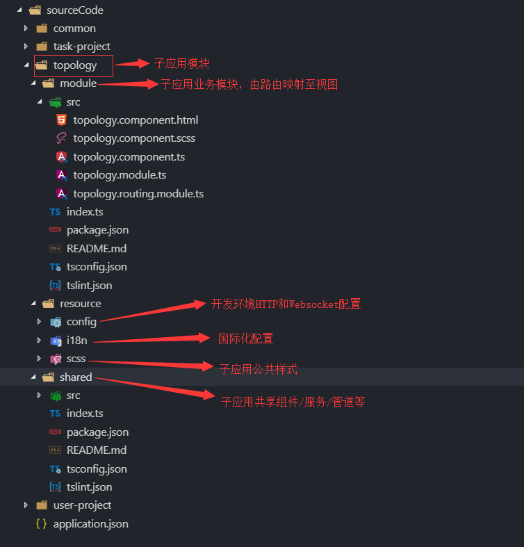

[TOC]


###  bss_cli脚手架

------

##### Usage

``` npm
npm install @hibiscus/cli -g
```

##### 概述

> @hibiscus/cli 是基于angular6 + ng-zorro开发的一个快速开发平台。提供前端架构模板以及通用业务代码快捷生成方式；


##### 从头开始一个应用

> 在工作空间中创建application.json。默认位置：d:/workspace/sourceCode
```json
{
    "name": "hibiscus", 
    "production": "hbs",
    "version": "1.0.0",
    "runtimePath": "d:/workspace/runtime",
    "distPath": "d:/workspace/dist",
    "subs": [
        {
            "name": "user-project",
            "modules": [
                {"name": "list"},
                {"name": "detail"}
            ]
        },
        {
            "name": "task-project",
            "modules": [
                {"name": "current"},
                {"name": "history"}
            ]
        },
        {
            "name": "topology"
        }
    ]
}

```
> 初始化

```shell
D:\sourceCode\cli\cli>bss init
[初始化] [INFO] 当前操作为Windows_NT
? 请输入产品工作空间路径 d:/workspace/sourceCode
[初始化] [INFO] 同步application.json
[app] [INFO] 读取application.json文件.
[render] [INFO] 创建文件d:/workspace/sourceCode/user-project/module/index.ts
[render] [INFO] 创建文件d:/workspace/sourceCode/user-project/module/package.json
...
[render] [INFO] 覆盖文件d:/workspace/runtime/topology/framework/tsconfig.json
[render] [INFO] 覆盖文件d:/workspace/runtime/topology/framework/src/index.html

```

> 切换子应用

```shell
D:\workspace>bss ls
[app] [INFO] 读取application.json文件.
? 选择子应用
  user-project
  task-project
> topology
```

> 设置npm仓库为私服地址。如http://sinopia:4873;  [设置node-sass地址不在此处叙述；](  https://blog.csdn.net/bug_zero/article/details/65968959 )

```powershell
npm config set registry http://sinopia:4873
```
> 安装依赖。

```shell
D:\sourceCode\cli\cli>bss install
[app] [INFO] 读取application.json文件.
[install] [INFO] > node-sass@4.11.0 install d:\workspace\runtime\topology\framework\node_modules\node-sass
[install] [INFO] > node scripts/install.js
[install] [INFO] Cached binary found at C:\Users\Administrator\AppData\Roaming\npm-cache\node-sass\4.11.0\win32-x64-57_binding.node
[install] [INFO] > node-sass@4.11.0 postinstall d:\workspace\runtime\topology\framework\node_modules\node-sass
[install] [INFO] > node scripts/build.js
[install] [INFO] Binary found at d:\workspace\runtime\topology\framework\node_modules\node-sass\vendor\win32-x64-57\binding.node
[install] [INFO] Testing binary
[install] [INFO] Binary is fine
[install] [INFO] added 1100 packages in 46.701s
```

> 启动服务

```shell
D:\sourceCode\cli\cli>bss serve
[app] [INFO] 读取application.json文件.
[copy] [INFO] 复制文件：d:/workspace/sourceCode/topology/resource/config => d:/workspace/runtime/topology/framework/src/assets/config
[render] [INFO] 覆盖文件d:/workspace/runtime/topology/framework/src/styles.scss
[serve] [INFO] 引入全局样式成功d:/workspace/runtime/topology/framework/src
[serve] [INFO] 国际化文件配置成功d:/workspace/runtime/topology/framework/src/assets/i18n
...
```

##### 命令大全

1. [Init](./commands/init/readme.md)

2. [Install](./bin/commands/install/readme.md)

3. [update](./bin/commands/update/readme.md)

4. [serve](./bin/commands/serve/readme.md)

5. [publish](./bin/commands/publish/readme.md)

6. [ls](./bin/commands/ls/readme.md)
   

##### 开发目录结构




##### 快速生成模板文件 [进行中...]

```shell
bss create <template> 
```

